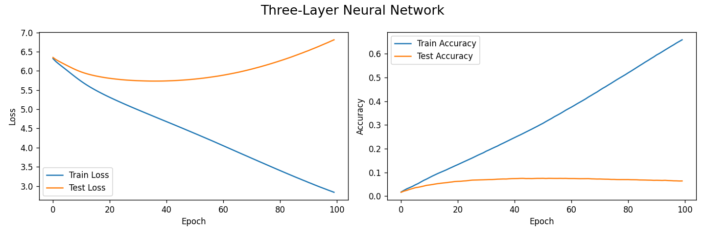

# numpy-ann: Image Classification from Scratch

A from-scratch implementation of neural network image classification using only NumPy and Autograd — no PyTorch, no TensorFlow, no scikit-learn. Built originally as a course assignment and later revisited to understand what actually went wrong the first time.

The dataset is [Tiny ImageNet](http://cs231n.stanford.edu/tiny-imagenet-200.zip): 200 classes, 500 training images each, at 64×64×3 pixels. Random chance is 0.5%. This repo documents two attempts at the problem, separated by three years and a clearer understanding of the code I had written.

---

## Results at a glance

| Version | Architecture | Optimizer | Test Accuracy |
|---------|-------------|-----------|---------------|
| V1 (2023) | 3-layer MLP | Adam (broken — see below) | **~7.5%** |
| V2 (2026) | 3-layer MLP + Dropout | Adam / NAG | **~14.76%** |



---

## V1 — Original Assignment Submission (Spring 2023)

This is the original code submitted for UVA's DS6210 (Numerical Analysis and Optimization for Data Science). The assignment required implementing an image classifier using **only NumPy and Autograd**, with two gradient-based optimizers compared against each other. Final grades were tied directly to top-1 test accuracy on a held-out evaluation set.

The submitted model achieved **~7.5% test accuracy**. The class high score was around 12%, so grades were curved heavily. The code in `v1/` has been reorganized from the original single-notebook submission into modules, but **no logic has been changed**. This is exactly what the model was when it was graded.

### Architecture

A three-layer fully-connected network operating on flattened RGB pixels:

```
input (12288) → Dense(512) → ReLU
              → Dense(256) → ReLU
              → Dense(128) → ReLU
              → Dense(200) → Softmax
```

**Training setup:**
- He initialization
- Adam optimizer (β₁=0.9, β₂=0.999)
- Cross-entropy loss with L2 regularization (λ=0.001)
- Learning rate: 0.001, Batch size: 50, 100 epochs
- Pixel values normalized to [-1, 1]
- Trained on a 10,000-image subset of the full 100,000-image training set

### What I actually submitted

The exploratory notebook (`v1/notebooks/exploration.ipynb`) walks through every model tried, in order:

1. **Vanilla logistic regression** — SGD baseline, ~2-3% test accuracy.
2. **Logistic regression with momentum** — slightly better training fit, no improvement on test.
3. **Three-layer MLP, Adam + L2, small-random init** — better, still overfit hard.
4. **Three-layer MLP, He initialization** *(submitted model)* — best of the lot at ~7.5%.

The written report (`v1/docs/analysis.pdf`) documents the rationale for each choice and includes loss/accuracy curves.

### What actually went wrong

Three years later, re-reading the code revealed two bugs that silently capped performance. Neither caused a crash or an obviously wrong result. The model trained, the loss decreased, and the numbers looked plausible, but that's what made them hard to catch at the time.

**Bug 1 — Adam was a no-op.**

The `update_parameters_adam()` method correctly computed bias-corrected moment estimates, but stored them in local variables that were immediately discarded. No weight update from Adam ever occurred. Meanwhile, `backward()` applied a plain SGD update before returning the gradients. Every run labeled "Adam" in the original notebook was actually vanilla SGD with learning rate 0.001. The Adam moment tracking was running in parallel, updating internal state, and doing nothing else.

This can be verified programmatically:

```python
W1_before = model.W1.copy()
grads = model.backward(X_batch, y_batch)   # SGD step happens here
model.update_parameters_adam(*grads, t=1)  # moments update; weights unchanged
assert np.allclose(model.W1 - W1_before, -lr * grads[0])  # passes — pure SGD
```

**Bug 2 — Training data was never reshuffled.**

Indices were shuffled once at load time, then mini-batches walked through the data in the same fixed order every epoch. With a class-balanced dataset this isn't the worst thing in the world, but it increases gradient variance and hurts convergence, which is particularly visible in the choppy loss curves in the original figures.

These two bugs together meant the model was undertrained relative to what the architecture could actually do. V2 fixes both and measures the difference.

### V1 repo layout

```
v1/
├── docs/
│   ├── analysis.pdf      # Original written report
│   ├── training_curves.png
│   └── v1_train.log      # Log file of V1 training
├── notebooks/
│   └── exploration.ipynb # Original exploratory notebook with all baselines
├── src/
│   ├── data.py           # Tiny ImageNet loading and preprocessing
│   ├── model.py          # HeThreeLayerNN class
│   ├── ops.py            # ReLU, softmax, cross-entropy + L2 loss
│   ├── run_v1.slurm      # Slurm script for submitting original job
│   ├── test.py           # Evaluation entry point (the graded deliverable)
│   ├── train.py          # Training entry point
│   └── weights.py        # JSON weight serialization
└── requirements.txt
```

### Running V1

```bash
# Download and unzip Tiny ImageNet
wget http://cs231n.stanford.edu/tiny-imagenet-200.zip
unzip tiny-imagenet-200.zip

pip install -r v1/requirements.txt

# Train (writes model_weights.json and training_curves.png)
python v1/src/train.py --epochs 100 --batch-size 50 --subset 10000

# Evaluate
python v1/src/test.py <test_image_dir> <test_label_file>
```

---

## V2 — Rebuilt (2026)

V2 starts from the same architecture and the same assignment constraints, fixes the bugs, and does what a careful student should have done the first time. The MLP is unchanged because the goal of V2 is to isolate how much of the V1 gap was engineering failure versus architectural ceiling.

Spoiler: most of it was engineering failure!

### What changed and why

**Bug fixes (same architecture, free performance upgrades):**

- Adam now actually updates weights. `backward()` computes and returns gradients only; `update_parameters_adam()` applies the full bias-corrected Adam step.
- Training indices are reshuffled at the start of each epoch.
- L2 penalty is excluded from the reported validation loss so train and test curves are directly comparable.

**Completing the assignment properly:**

The original assignment required two optimizers compared against each other. V1 nominally implemented Adam and SGD-with-momentum, but Adam was broken and the comparison was never drawn cleanly. V2 implements both properly as standalone classes and runs a controlled comparison:

- **Adam:** fixed implementation of the original optimizer.
- **Nesterov Accelerated Gradient (NAG):** second optimizer with different convergence behavior. NAG's look-ahead gradient step gives it better theoretical convergence properties on convex problems and noticeably different dynamics on non-convex ones. The comparison between Adam and NAG on a non-convex MLP is one of the more honest things this project can show.

Both optimizers are implemented in `v2/src/optim.py` as standalone classes, decoupled from the model. This makes the comparison clean and the individual implementations testable.

**Autograd used properly:**

V1 imported `autograd` in one notebook cell and never used it; the cell was killed by a `KeyboardInterrupt` before it finished. V2 uses autograd for numerical gradient verification in `v2/tests/gradient_check.py`. This serves two purposes: it confirms the hand-written backward pass is correct before any training begins, and it demonstrates that the analytical and numerical gradients agree to five decimal places. If I had done this originally, I would have caught Bug 1 immediately.

**Training improvements:**

- Full 100,000-image training set (not the 10k subset used in V1).
- Proper train / validation / test split (80% / 10% / 10%), so hyperparameters are selected on validation and final numbers are reported on a held-out test set.
- Early stopping on validation loss with patience of 15 epochs; best-validation weights are saved and restored.
- Dropout (p=0.3) on each hidden layer.
- Horizontal flip augmentation on 50% of each training batch; one line, meaningful regularization on a symmetric image task.
- Cosine learning rate decay over the full training run.

**Extra credit items from the assignment rubric:**

The assignment explicitly denoted that extra credit would be given for sensitivity analysis:

- The written report (`v2/docs/analysis.pdf`) includes a conditioning analysis of the softmax Jacobian under different initialization schemes, which motivates He initialization with a number rather than a citation.

### Architecture

Same MLP, with dropout added:

```
input (12288) → Dense(512) → ReLU → Dropout(0.3)
              → Dense(256) → ReLU → Dropout(0.3)
              → Dense(128) → ReLU → Dropout(0.3)
              → Dense(200) → Softmax
```

**Training setup:**
- He initialization
- Adam (β₁=0.9, β₂=0.999) or NAG (momentum=0.9), selectable via CLI flag
- Cross-entropy loss with L2 regularization (λ=0.001)
- Initial learning rate = 0.001 with cosine decay
- Batch size = 128
- Early stopping patience = 15 on validation loss
- Pixel values normalized to [-1, 1]
- Horizontal flip augmentation
- Full 100,000-image training set

### Results

**Optimizer comparison (same MLP, same training budget):**

| Optimizer | Val Accuracy (best) | Test Accuracy | Epochs to convergence | Training Time |
|-----------|--------------------:|--------------|----------------------|-------------|
| Adam | 13.90% | 14.76% | 150 (Full run) | 98.5 min |
| NAG | 11.55% | 12.18% | 94 | 48.6 min |

**V1 vs V2 (Adam, same architecture):**

| | V1 | V2 | Δ |
|--|----|----|---|
| Test accuracy | ~7.5% | 14.76% | +7.26pp (2×) |
| Training set size | 10k | 100k | 10× |
| Optimizer (effective) | SGD | Adam | — |
| Epochs trained | 100 | 150 (full) | — |
| Train/test gap | ~58pp | ~0.2pp | massive improvement |

The near-zero train/test gap in V2 (versus 58 percentage points in V1) is the clearest evidence that the V1 gap was regularization failure, not architectural ceiling. L2 was being computed but never applied.

<table>
  <tr>
    <td></td>
    <td></td>
  </tr>
  <tr>
    <td align="center"><em>Adam — 14.76% test accuracy, 150 epochs</em></td>
    <td align="center"><em>NAG — 12.18% test accuracy, stopped epoch 94</em></td>
  </tr>
</table>

### V2 repo layout

```
v2/
├── docs/
│   ├── v2_curves_adam.png      
│   ├── v2_curves_nag.png
│   ├── v2_log_adam.log          # Log file of V2 Adam training
│   └── v2_log_nag.log           # Log file of V2 Nag training
├── src/
│   ├── data.py                  # Data loading + horizontal flip augmentation
│   ├── model.py                 # Same MLP architecture, adds dropout
│   ├── ops.py                   # Activation functions, loss, dropout op
│   ├── optim.py                 # Adam and NAG as standalone optimizer classes
│   ├── run_v2_adam.slurm        # Slurm script for submitting Adam job
│   ├── run_v2_nag.slurm         # Slurm script for submitting NAG job
│   ├── schedule.py              # Cosine learning rate decay
│   ├── test.py                  # Evaluation entry point
│   ├── train.py                 # Training loop with optimizer/schedule flags
│   └── weights.py               # JSON weight serialization (unchanged)
├── tests/
│   ├── gradient_check.py        # Numerical gradient verification via autograd
│   └── precision_comparison.py  # float32 vs float64 timing and accuracy
└── requirements.txt
```

### Running V2

```bash
pip install -r v2/requirements.txt

# Verify gradient implementation before training
python v2/tests/gradient_check.py

# Train with Adam (default)
python v2/src/train.py --optimizer adam --epochs 100 --batch-size 128

# Train with NAG for comparison
python v2/src/train.py --optimizer nag --epochs 100 --batch-size 128

# Run the precision experiment
python v2/experiments/precision_comparison.py

# Evaluate
python v2/src/test.py <test_image_dir> <test_label_file>
```

---

## What I learned

The most useful thing this project demonstrated has nothing to do with image classification. It's that **a silently broken optimizer looks exactly like an undertrained model**. The loss goes down. The accuracy goes up. The curves look reasonable. Without a gradient check or a controlled comparison against a known-good baseline, there's nothing obviously wrong.

In a research or production setting, that kind of failure is expensive precisely because it's invisible. The fix for V2 (writing `gradient_check.py` before touching the training loop) is the habit that would have caught it in 2023. It cost me 30 minutes once and saves an unknown amount of confusion later.

The architectural ceiling also matters. Even with everything fixed, a fully-connected net on flattened pixels is the wrong tool for image classification. Spatial structure is real and CNNs exploit it. The V2 numbers are honest about where the MLP ceiling is; V3 (planned) will implement a small CNN from scratch and show what the same NumPy-only constraint can do with the right inductive bias.

---

## Setup

**Requirements:** Python 3.9+, NumPy, Autograd, Matplotlib, Pillow, tqdm

```bash
# Dataset
wget http://cs231n.stanford.edu/tiny-imagenet-200.zip
unzip tiny-imagenet-200.zip

# Dependencies (either version)
pip install -r v1/requirements.txt
pip install -r v2/requirements.txt
```

The dataset directory (`tiny-imagenet-200/`) and all weight files (`*.json`) are excluded from version control via `.gitignore`. Model weights for the V1 submission and V2  are available on request.

---

## Repository structure

```
numpy-ann/
├── v1/                   # Original 2023 submission, reorganized
├── v2/                   # Rebuilt 2026 version
├── README.md             # This file
└── .gitignore
```